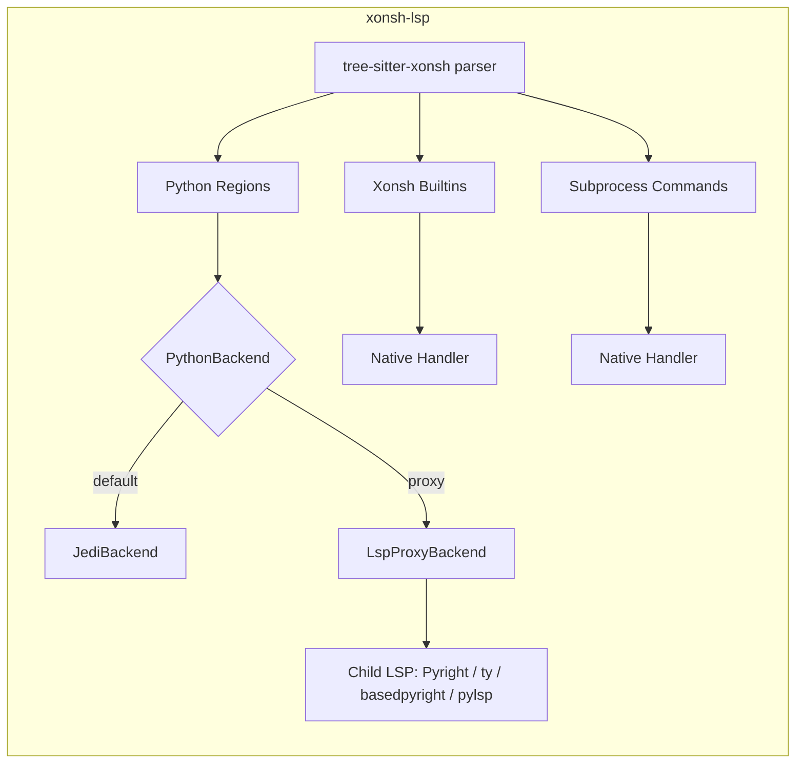

# xonsh-lsp

A Language Server Protocol (LSP) implementation for [xonsh](https://xon.sh/), the Python-powered shell.

## Features

- [x] **Syntax Highlighting** (via tree-sitter-xonsh integration)
- [x] **Code Completion**
  - [x] Environment variables (`$VAR`, `${expr}`)
  - [x] Subprocess commands from PATH
  - [x] Shell builtins (cd, echo, jobs, etc.)
  - [x] Xonsh builtins and aliases (source, xontrib, aliases, etc.)
  - [x] Python completions (via Jedi or external backend)
  - [x] Path completions with directory traversal
  - [x] Glob pattern completions (`` `...` ``)
  - [x] At-object completions (`@.env`, `@.imp`)
  - [x] Path literal completions (`p"..."`, `pf"..."`)
- [x] **Diagnostics**
  - [x] Syntax errors (via tree-sitter)
  - [x] Undefined environment variables (with quick fix)
  - [x] Unknown commands (hint severity)
  - [x] Empty subprocess warnings
  - [x] Python errors (via Jedi or external backend)
- [x] **Hover Information**
  - [x] Environment variable values
  - [x] Xonsh operator documentation (`$()`, `!()`, `$[]`, `![]`, `@()`, `@$()`)
  - [x] Xonsh builtin documentation
  - [x] Command paths and `--help` preview
  - [x] Python symbol information with signatures
  - [x] Path literal documentation
- [x] **Go to Definition**
  - [x] Python definitions (via Jedi or external backend)
  - [x] Environment variable assignments
  - [x] Alias definitions
  - [x] Function definitions
- [x] **Find References**
  - [x] Python references (via Jedi or external backend)
  - [x] Environment variable references
  - [x] Symbol references
- [x] **Signature Help**
  - [x] Python function signatures (via Jedi or external backend)
  - [x] Parameter tracking
- [x] **Document Symbols**
  - [x] Functions, classes, variables, modules
- [x] **Code Actions**
  - [x] Quick fix for undefined environment variables
- [x] **Multi-Backend Support**
  - [x] Built-in Jedi backend (default, no external dependencies)
  - [x] LSP proxy to Pyright, basedpyright, pylsp, ty, or any LSP server
  - [x] Transparent settings passthrough (editor → child backend)
  - [x] Fallback `backendSettings` via `initializationOptions`

## Installation

```bash
pip install xonsh-lsp
# or just run
uvx xonsh-lsp
```

To install with the built-in Jedi backend (recommended for standalone use):

```bash
pip install "xonsh-lsp[jedi]"
```

Jedi is optional — if you configure an external backend (Pyright, ty, etc.), you don't need Jedi installed.

## Usage

### Command Line

```bash
# Start with stdio (default, for editor integration)
xonsh-lsp

# Start with TCP
xonsh-lsp --tcp --host 127.0.0.1 --port 2087

# Debug mode
xonsh-lsp --log-level DEBUG

# Use Pyright as the Python backend
xonsh-lsp --python-backend pyright

# Use ty as the Python backend
xonsh-lsp --python-backend ty

# Use a custom LSP server command
xonsh-lsp --python-backend lsp-proxy --backend-command my-lsp-server --stdio
```

### Neovim Integration

> Currently this LSP server is in beta stage; adding it to canonical Neovim echosystem tools is planned
> but may take some time. For now, a manual approach is recomended

Add to your Neovim configuration (using `nvim-lspconfig`):

```lua
local lspconfig = require('lspconfig')
local configs = require('lspconfig.configs')

-- Register xonsh-lsp
if not configs.xonsh_lsp then
  configs.xonsh_lsp = {
    default_config = {
      cmd = { 'xonsh-lsp' }, -- <-- manage server installation manually
      filetypes = { 'xonsh', 'xsh' },
      root_dir = function(fname)
        return lspconfig.util.find_git_ancestor(fname) or vim.fn.getcwd()
      end,
      settings = {},
    },
  }
end

-- Set up the LSP
lspconfig.xonsh_lsp.setup({
  on_attach = function(client, bufnr) end,
  capabilities = require('cmp_nvim_lsp').default_capabilities(),
})

-- Associate file types
vim.filetype.add({
  extension = {
    xsh = 'xonsh',
    xonshrc = 'xonsh',
  },
  filename = {
    ['.xonshrc'] = 'xonsh',
  },
})
```

#### Using Pyright as the Python backend

```lua
lspconfig.xonsh_lsp.setup({
  init_options = {
    pythonBackend = "pyright",
  },
  -- Your existing Pyright-style settings — forwarded transparently to the child backend
  settings = {
    python = {
      pythonPath = "/path/to/python",  -- or detected via your own on_attach
      analysis = {
        autoSearchPaths = true,
        useLibraryCodeForTypes = true,
      },
    },
  },
})
```

#### Using ty as the Python backend

```lua
lspconfig.xonsh_lsp.setup({
  init_options = {
    pythonBackend = "ty",
  },
})
```

Your existing Python backend configuration (e.g. `settings.python.*`) is forwarded
transparently to the child LSP — xonsh-lsp does not try to detect or override paths itself.

## Configuration

### Python Backend

xonsh-lsp supports multiple Python analysis backends. The backend handles completions, hover,
go-to-definition, references, signature help, and diagnostics for Python code within xonsh files.

| Backend | Command | Description |
|---------|---------|-------------|
| `jedi` (default) | built-in | Uses [Jedi](https://github.com/davidhalter/jedi) for static analysis. Works out of the box, no external process. |
| `pyright` | `pyright-langserver --stdio` | Microsoft's [Pyright](https://github.com/microsoft/pyright) type checker. Respects `pyrightconfig.json`. |
| `basedpyright` | `basedpyright-langserver --stdio` | Community fork [basedpyright](https://github.com/DetachHead/basedpyright) with additional features. |
| `pylsp` | `pylsp` | The [Python LSP Server](https://github.com/python-lsp/python-lsp-server) with plugin ecosystem. |
| `ty` | `ty server` | Astral's [ty](https://github.com/astral-sh/ty) type checker — extremely fast, written in Rust. |
| `lsp-proxy` | custom | Any LSP server via `--backend-command`. |

The backend can be set via CLI args or editor `initializationOptions`:

**CLI:**
```bash
xonsh-lsp --python-backend pyright
```

**Editor initializationOptions:**
```jsonc
{
  "pythonBackend": "pyright"
}
```

### Initialization Options

The full set of `initializationOptions` accepted by xonsh-lsp:

```jsonc
{
  // Python analysis backend: "jedi", "pyright", "basedpyright", "pylsp", "ty", or "lsp-proxy"
  "pythonBackend": "jedi",

  // Custom command for the "lsp-proxy" backend (not needed for named backends)
  "pythonBackendCommand": ["my-lsp-server", "--stdio"],

  // Fallback settings sent to the backend during initialization.
  // Normally you should configure your backend via the editor's settings
  // (e.g. Neovim's `settings = { ... }`), which are forwarded transparently.
  // Use this only if your editor doesn't support workspace/configuration.
  "backendSettings": { }
}
```

### Settings Passthrough

When the child backend requests its configuration (via `workspace/configuration`),
xonsh-lsp forwards the request to your editor and returns the editor's response.
This means your existing Python backend settings — `pythonPath`, `python.analysis.*`,
etc. — work exactly as if the backend were running standalone.

If the editor doesn't respond (or `workspace/configuration` is not supported),
xonsh-lsp falls back to `backendSettings` from `initializationOptions`.

### How the LSP Proxy Works

When configured with an external backend, xonsh-lsp acts as LSP middleware:

1. **Receives** requests from the editor (completions, hover, etc.)
2. **Preprocesses** xonsh syntax to valid Python (e.g., `$HOME` → `__xonsh_env__["HOME"]`)
3. **Forwards** the preprocessed Python to the child LSP server
4. **Maps** positions in the response back to the original xonsh source
5. **Merges** results with xonsh-specific features (env vars, operators, commands)

Xonsh-specific features (environment variable completions, operator hover, subprocess
diagnostics, etc.) are always handled natively — only Python analysis is delegated to
the backend.

**Diagnostics** use a two-phase merge:
- Xonsh diagnostics (syntax errors, undefined env vars, unknown commands) are published immediately
- Python diagnostics from the backend arrive asynchronously and are merged with the cached xonsh diagnostics

## Architecture



## Contributing

Contributions are welcome! Please feel free to submit issues and pull requests; especially flagging unsupported xonsh syntax since this LSP is young.

## License

MIT

## Related Projects

- [tree-sitter-xonsh](https://github.com/FoamScience/tree-sitter-xonsh) - Tree-sitter grammar for xonsh
- [xonsh](https://xon.sh/) - The xonsh shell
- [pygls](https://github.com/openlawlibrary/pygls) - Python LSP library
- [jedi](https://github.com/davidhalter/jedi) - Python static analysis
- [ty](https://github.com/astral-sh/ty) - Extremely fast Python type checker and LSP
- [pyright](https://github.com/microsoft/pyright) - Static type checker for Python
