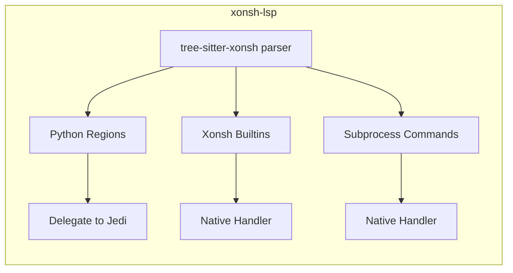

# xonsh-lsp

A Language Server Protocol (LSP) implementation for [xonsh](https://xon.sh/), the Python-powered shell.

## Features

- [x] **Syntax Highlighting** (via tree-sitter-xonsh integration)
- [x] **Code Completion**
  - [x] Environment variables (`$VAR`, `${expr}`)
  - [x] Subprocess commands from PATH
  - [x] Shell builtins (cd, echo, jobs, etc.)
  - [x] Xonsh builtins and aliases (source, xontrib, aliases, etc.)
  - [x] Python completions (via Jedi)
  - [x] Path completions with directory traversal
  - [x] Glob pattern completions (`` `...` ``)
  - [x] At-object completions (`@.env`, `@.imp`)
  - [x] Path literal completions (`p"..."`, `pf"..."`)
- [x] **Diagnostics**
  - [x] Syntax errors (via tree-sitter)
  - [x] Undefined environment variables (with quick fix)
  - [x] Unknown commands (hint severity)
  - [x] Empty subprocess warnings
  - [x] Python errors (via Jedi)
- [x] **Hover Information**
  - [x] Environment variable values
  - [x] Xonsh operator documentation (`$()`, `!()`, `$[]`, `![]`, `@()`, `@$()`)
  - [x] Xonsh builtin documentation
  - [x] Command paths and `--help` preview
  - [x] Python symbol information with signatures
  - [x] Path literal documentation
- [x] **Go to Definition**
  - [x] Python definitions (via Jedi)
  - [x] Environment variable assignments
  - [x] Alias definitions
  - [x] Function definitions
- [x] **Find References**
  - [x] Python references (via Jedi)
  - [x] Environment variable references
  - [x] Symbol references
- [x] **Signature Help**
  - [x] Python function signatures (via Jedi)
  - [x] Parameter tracking
- [x] **Document Symbols**
  - [x] Functions, classes, variables, modules
- [x] **Code Actions**
  - [x] Quick fix for undefined environment variables

## Installation

```bash
pip install xonsh-lsp
# or just run
uvx xonsh-lsp
```

## Usage

### Command Line

```bash
# Start with stdio (default, for editor integration)
xonsh-lsp

# Start with TCP
xonsh-lsp --tcp --host 127.0.0.1 --port 2087

# Debug mode
xonsh-lsp --log-level DEBUG
```

### Neovim Integration

> Currently this LSP server is in beta stage; adding it to canonical Neovim echosystem tools is planned
> but may take some time. For now, a manual approach is recomended

Add to your Neovim configuration (using `nvim-lspconfig`):

```lua
local lspconfig = require('lspconfig')
local configs = require('lspconfig.configs')

-- Register xonsh-lsp
if not configs.xonsh_lsp then
  configs.xonsh_lsp = {
    default_config = {
      cmd = { 'xonsh-lsp' }, -- <-- manage server installation manually
      filetypes = { 'xonsh', 'xsh' },
      root_dir = function(fname)
        return lspconfig.util.find_git_ancestor(fname) or vim.fn.getcwd()
      end,
      settings = {},
    },
  }
end

-- Set up the LSP
lspconfig.xonsh_lsp.setup({
  on_attach = function(client, bufnr) end,
  capabilities = require('cmp_nvim_lsp').default_capabilities(),
})

-- Associate file types
vim.filetype.add({
  extension = {
    xsh = 'xonsh',
    xonshrc = 'xonsh',
  },
  filename = {
    ['.xonshrc'] = 'xonsh',
  },
})
```

## Configuration

The LSP server accepts the following configuration options (via LSP settings):

```json
{
  "xonsh-lsp": {
    "diagnostics": {
      "enabled": true,
      "undefinedEnvVars": true,
      "unknownCommands": true
    },
    "completion": {
      "envVars": true,
      "commands": true,
      "xonshBuiltins": true,
      "python": true
    }
  }
}
```

## Architecture



## Contributing

Contributions are welcome! Please feel free to submit issues and pull requests; especially flagging unsupported xonsh syntax since this LSP is young.

## License

MIT

## Related Projects

- [tree-sitter-xonsh](https://github.com/FoamScience/tree-sitter-xonsh) - Tree-sitter grammar for xonsh
- [xonsh](https://xon.sh/) - The xonsh shell
- [pygls](https://github.com/openlawlibrary/pygls) - Python LSP library
- [jedi](https://github.com/davidhalter/jedi) - Python static analysis
